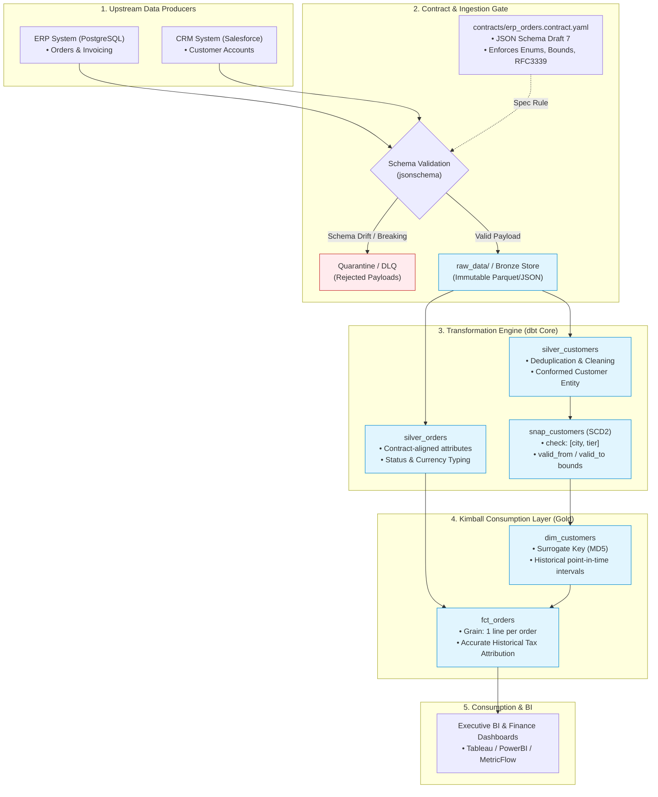

<<<<<<< HEAD
# enterprise-data-platform
=======
# Enterprise Data Platform Reference Architecture

## 💼 Business Context & Problem Statement

**Domain:** Global B2B Omnichannel Fulfillment & Commercial Finance

**The Problem:** Upstream ERP migrations and frequent CRM changes caused unannounced schema drift, resulting in broken nightly reporting, misstated regional sales tax liabilities, and billing discrepancies across EMEA operations. Furthermore, analytical ad-hoc queries frequently resource-starved the batch ingestion pipeline, risking operational SLA breaches.

**The Solution:** A decoupled, contract-governed analytical platform:

1. **Zero-Trust Ingestion:** Producer-owned JSON Schema contracts catch and quarantine breaking payload changes before publication.
2. **Audit & Replay:** Raw Bronze storage preserves origin events immutably to satisfy statutory 7-year audit requirements.
3. **Conformed History:** dbt-driven Silver conformance feeds a Kimball Gold Star Schema with SCD Type 2 dimension tracking, ensuring point-in-time revenue accuracy when customer tax jurisdictions or tiers change.
4. **FinOps & Workload Isolation:** Declarative Terraform infrastructure isolates ETL compute clusters from high-concurrency BI serving, with automated suspend policies reducing idle compute costs.

> *"In enterprise environments, data engineering usually struggles with two core tensions: silent upstream schema drift breaking downstream finance, and monolithic compute clusters where ad-hoc BI queries stall critical batch pipelines. To demonstrate how to solve this at an enterprise level, I built a reference data platform modeled on a global B2B order fulfillment domain. First, I implemented producer-consumer data contracts using JSON Schema Draft 7. Upstream ERP emitters must comply with the contract; any breaking change—like a renamed currency field or invalid status—is quarantined at the boundary before it can pollute analytics. Second, I adopted a strict Medallion lifecycle. Bronze is immutable and append-only for statutory auditability. Silver handles normalization and deduplication in portable ANSI dbt SQL. Gold is modeled as a Kimball Star Schema with SCD Type 2 tracking on the customer dimension—so when a client relocates their billing jurisdiction mid-year, historical revenue records remain completely audit-accurate without overwriting past state. Finally, I codified the compute layer with Terraform, enforcing strict workload isolation between transformation and BI clusters, backed by automated GitHub Actions CI that tests the contracts and dbt models sequentially. The result is an auditable, self-healing pipeline where business logic is decoupled, infrastructure is reproducible, and downstream stakeholders have guaranteed SLAs."*


## System Architecture & Data Flow



## Architecture Narrative

> This design addresses the two most common enterprise data failures: silent schema drift in upstream systems and compute contention between critical transformation jobs and ad-hoc BI workloads. By enforcing contract governance at the boundary and separating transformation compute from serving compute, the platform creates a reliable basis for finance-grade reporting and operational analytics.


## Repository Goal

This project is designed as a portfolio-ready data architecture reference implementation for enterprise data professionals. It demonstrates:


## Project Structure

```text
enterprise-data-platform/
├── .github/
│   └── workflows/
│       └── ci.yml
├── contracts/
│   ├── erp_orders.contract.yaml
│   └── tests/
│       ├── fixtures/
│       │   ├── valid_order.json
│       │   ├── missing_required_field.json
│       │   ├── invalid_enum.json
│       │   ├── invalid_numeric_range.json
│       │   └── invalid_datetime.json
│       └── test_erp_orders_contract.py
├── raw_data/
│   ├── bronze_orders_batch_t0.json
│   └── bronze_customers_scd2_source.csv
├── dbt_transforms/
│   ├── dbt_project.yml
│   ├── profiles.yml
│   ├── models/
│   │   ├── silver/
│   │   │   ├── silver_orders.sql
│   │   │   └── silver_customers.sql
│   │   └── gold/
│   │       ├── dim_customers.sql
│   │       └── fct_orders.sql
│   └── snapshots/
│       └── snap_customers.sql
├── terraform/
│   └── modules/
│       └── compute_warehouse/
│           ├── main.tf
│           └── variables.tf
├── docs/
│   └── adr/
│       ├── 001-medallion-boundary-isolation.md
│       ├── 002-kimball-vs-datavault.md
│       ├── 003-contract-driven-ingestion.md
│       ├── 004-elt-pushdown-selection.md
│       └── 005-platform-and-engine-neutrality.md
├── Makefile
├── requirements-dev.txt
├── LICENSE
└── README.md
```


## Recruiter-Facing Summary

> **Enterprise Data Platform Reference Architecture**
>
> - Designed and built an end-to-end governed analytical platform implementing producer-owned JSON Schema Draft 7 data contracts, strict Medallion lifecycle boundaries, and Kimball dimensional modeling with SCD Type 2 tracking.
> - Implemented portable ANSI-aligned dbt Core transformations with DuckDB local execution parity and declarative Terraform patterns for isolated ETL vs. BI compute governance.
> - Documented formal Architecture Decision Records (ADRs) evaluating Medallion isolation, Kimball vs. Data Vault, and contract-driven boundary validation.

## 3-Minute Technical Interview Response

> "When designing an enterprise data platform, my priority is ensuring that governance and reliability are structural guarantees, not afterthoughts. In my reference architecture project, I tackled the common problem of silent upstream schema drift breaking downstream finance reports. I established a producer-contract boundary using JSON Schema Draft 7 with strict RFC3339 validation. If an ERP system suddenly emits an unmapped status or malformed timestamp, the ingestion gate halts that record and routes it to quarantine without failing the entire batch or polluting analytics. Downstream from raw immutable storage, I structured the transformation layer using the Medallion pattern via dbt Core. Silver standardizes entities, while Gold delivers a Kimball Star Schema with Slowly Changing Dimensions (SCD Type 2). A concrete scenario in the model is tax attribution: when a B2B customer moves offices from Amsterdam to Rotterdam, our fact table uses point-in-time joins against surrogate keys. An order placed in February attributes revenue to Amsterdam, while an order placed in April attributes to Rotterdam—maintaining statutory audit accuracy. Finally, I documented all foundational trade-offs in formal ADRs and codified compute isolation between batch ETL and BI serving using Terraform. Everything is validated end-to-end via an automated GitHub Actions CI pipeline."


## Local Quickstart

```bash
pip install -r requirements-dev.txt
pytest contracts/tests/ -v
cd dbt_transforms
dbt deps
dbt compile --profiles-dir .
dbt run --select silver gold --profiles-dir .
dbt snapshot --profiles-dir .
dbt test --profiles-dir .
cd ../terraform/modules/compute_warehouse
terraform init -backend=false
terraform validate
```


## 8. Engineering Insights & Architectural Lessons

Building and validating this reference architecture surfaced several subtle operational and technical realities:

1. **Format Enforcement Requires Explicit Dependencies:** JSON Schema Draft 7 does not automatically validate ISO8601/RFC3339 timestamps simply because `format: date-time` is declared. Without the underlying format checker dependencies (`rfc3339-validator`), syntactically malformed timestamps pass through silently. Governance rules must be backed by explicit validator configurations.
2. **DAG Dependencies in Snapshot Orchestration:** In dbt, an SCD Type 2 snapshot cannot execute against an unmaterialized or non-existent relational model. The orchestration sequence must enforce strict layer progression: `compile` -> `run (silver)` -> `snapshot` -> `run (gold)` -> `test`. Attempting to snapshot before source views/tables exist causes cold-start build failures.
3. **Point-in-Time Join Cardinality:** Joining granular transaction facts to SCD Type 2 dimensions on temporal ranges (`order_timestamp >= valid_from AND (order_timestamp < valid_to OR valid_to IS NULL)`) requires disciplined surrogate key generation. Any overlapping validity windows in the dimension table instantly cause fan-out duplication in financial metrics.
4. **Separation of Contract Metadata vs. Schema Constraints:** Operational SLAs, data classifications, and retention periods should live alongside schema definitions for catalog discoverability, but must be programmatically segregated from runtime deserialization validators to prevent parser overhead during ingestion.


## 9. High-Impact CV Bullets


## 10. LinkedIn Featured Post & Profile Snippet

### Profile "Featured" Link / Project Section


### LinkedIn Launch Post Copy (Ready to Publish)

```text
When evaluating modern data platforms, enterprise leaders frequently run into two major friction points:
1. Upstream schema drift silently corrupting downstream financial reporting.
2. Monolithic compute clusters where ad-hoc BI queries stall business-critical batch pipelines.

To explore how these challenges are solved through system design rather than vendor hype, I built an executable reference architecture:

🏛️ Enterprise Data Platform: Medallion Storage, Data Contracts & Kimball Modeling

Key architectural patterns demonstrated in the project:
• Zero-Trust Ingestion: Producer-owned JSON Schema Draft 7 contracts that quarantine breaking changes at the boundary before they hit analytics.
• Medallion Lifecycle: Strict physical and logical separation—immutable Bronze for audit/replayability, normalized Silver entities, and Kimball Gold Star Schemas.
• Deterministic History (SCD2): Time-bound surrogate key lookups ensuring point-in-time revenue and tax attribution remain accurate across historical client movements.
• FinOps & Workload Isolation: Terraform-managed compute clusters isolating transformation spikes from warm BI query caches.
• Architecture Decision Records (ADRs): Detailed trade-off matrices documenting why we selected Kimball over Data Vault for this workload and how boundary contracts protect consumer SLAs.

The full repository includes working contract fixtures, dbt models, snapshots, and CI pipeline checks.

🔗 Check out the architecture and code here: [Insert your GitHub URL]

#DataArchitecture #DataEngineering #dbt #Kimball #DataGovernance #Terraform #CloudData
```


## 11. Git Push & Release Walkthrough

Run these commands in your project root terminal to push the finalized portfolio upstream to GitHub:

```bash
# 1. Verify working directory status
git status

# 2. Stage all polished documentation, ADRs, models, and tests
git add README.md docs/ dbt_transforms/ contracts/ raw_data/ terraform/ Makefile .github/

# 3. Create a clean, professional release commit
git commit -m "docs: finalize architecture documentation, ADRs, and SCD2 models for v1.0 release"

# 4. (Optional) Tag the repository as an initial architectural release
git tag -a v1.0.0 -m "Release v1.0.0: Enterprise Data Platform Reference Architecture"

# 5. Push code and tags to your remote repository
git push origin main
git push origin --tags
```

